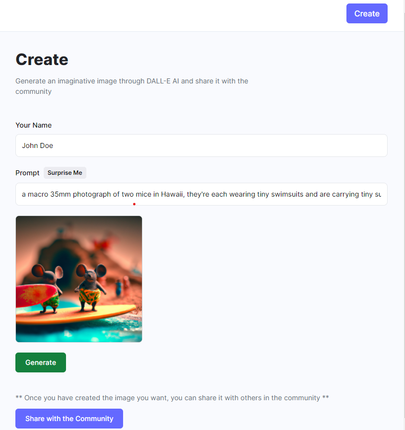

# ImagineAI

This is a MERN (MongoDB, Express.js, React.js, Node.js) stack application that utilizes the DALL-E API for generating images from words. The app allows users to 
create unique and imaginative images by inputting descriptive words or phrases, which are then processed by the DALL-E API to generate corresponding images. After 
generating images if we want we can also share it with the community (Within the application).   

## Features

* **Image Generation**: Users can input words or phrases and generate images based on the input using the powerful DALL-E API. The app sends requests to the API and displays the generated images to the users.  

* **Community Sharing**: Users can share the images they generate with the community within the application. This encourages collaboration and creativity among the app users. Other community members can view and download the shared images.  

* **Image Download**: Users have the option to download the generated images to their devices. This allows them to use the images in various ways, such as incorporating them into their designs, sharing them on social media, or printing them.  

## Technologies Used

* **MERN Stack**: The application is built using the MongoDB database, Express.js for the server, React.js for the frontend, and Node.js for the backend.  

* **DALL-E API**: The DALL-E API is used to generate images based on the input words or phrases provided by the users. This API leverages deep learning and generative models to create unique and realistic images.  

* **Cloudinary**: We employed Cloudinary to store user-shared images for community building within our application.

## Contribution

Contributions to the ImagineAI (DALL-E image generating app) are welcome! If you find any issues or have suggestions for improvements, please feel free to open an issue or submit a pull request.  

## License

This project is licensed under the **MIT License**.

## Acknowledgments

* The DALL-E API for providing a powerful image generation capability.
* OpenAI and the developers who have contributed to the DALL-E project.
* Please note that this application uses the DALL-E API, which may have its own usage restrictions and terms of service. Make sure to review and comply with the API's guidelines when using the application.
<!-- 
### Sample Image

 -->

### Deployed Link

https://imagine-ai-dall-e-2.netlify.app/
